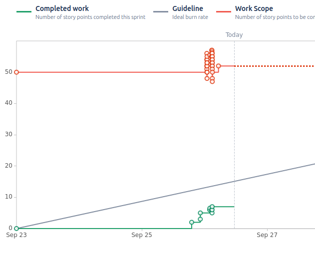
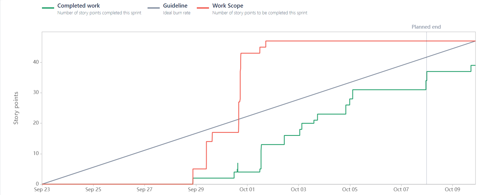

# Bullet Journal
Digital bullet journal that helps creatives, students, and professionals balance their mental health, work, and ideas. 
## Created by
Noah Alavi, Frances Andrews, Shawn Spicer, and Athene Yowell.

## General Information
- Bullet Journal is a digital bullet journal application that allows users to track mental health over time, utilize journaling and note taking functionality, keep track of their work, and syncing with their calendar of choice.
- As students we were inspired by physical bullet journals and the mindset it fosters. Note taking apps are often minimalist, so we decided to make a customizable app that integrates functionality impossible in a physical journal, such as music or dynamic calendaring.
- We hope that this application will give the user a pleasant and efficient user experience with whichever functionality they use, be it listening to music and journaling, tracking their mood and creating graphs with the data, or tracking their assignments and staying on top of their work.

## Technologies Used
- Quotes: https://api-ninjas.com/api/quotes
- Recipes: https://api-ninjas.com/api/recipe 
- Spotify: https://developer.spotify.com/documentation/web-api
- Images: https://api-ninjas.com/api/randomimagelimited
- Googles Calendar: https://developers.google.com/calendar/api/guides/overview
- Outlook: https://learn.microsoft.com/en-us/outlook/rest/get-started
- Canvas: https://canvas.instructure.com/doc/api/
- This project was built on top of https://bitbucket.org/txstatecs3398all/flask_email_openai_example

### Sprint 1

#### Contributions

**Noah**: "Built the journal entries webpage, and integrated SimpleMDE API" 

  - `Jira Task: Task 1: Research options to create markdown files and display them` 
    - [GRO-85](https://cs3398-betazoids-f24.atlassian.net/jira/software/projects/GRO/boards/2?selectedIssue=GRO-85), 
    [Bitbucket](https://bitbucket.org/cs3398-betazoids-f24/%7B029ccb6f-2730-489b-9350-d5527dec1d1f%7D/branch/GRO-85-task-1-research-options-to-create) 
  - `Jira Task: Task 2: Create journal route and HTML` 
    - [GRO-81](https://cs3398-betazoids-f24.atlassian.net/jira/software/projects/GRO/boards/2?selectedIssue=GRO-81), 
    [Bitbucket](https://bitbucket.org/cs3398-betazoids-f24/%7B029ccb6f-2730-489b-9350-d5527dec1d1f%7D/branch/GRO-81-task-2-create-journal-route-form-) 
  - `Jira Task: Task 3:  Integrate Markdown Editing API (using SimpleMDE)` 
    - [GRO-119](https://cs3398-betazoids-f24.atlassian.net/jira/software/projects/GRO/boards/2?selectedIssue=GRO-119), 
    [Bitbucket](https://bitbucket.org/cs3398-betazoids-f24/%7B029ccb6f-2730-489b-9350-d5527dec1d1f%7D/branch/feature/GRO-119-task-3-integrate-SimpleMDE) 
  - `Jira Task: Task 4: Link “create” button on form to creation of markdown file` 
    - [GRO-91](https://cs3398-betazoids-f24.atlassian.net/jira/software/projects/GRO/boards/2?selectedIssue=GRO-91), 
    [Bitbucket](https://bitbucket.org/cs3398-betazoids-f24/%7B029ccb6f-2730-489b-9350-d5527dec1d1f%7D/branch/GRO-91-task-4-link-%E2%80%9Ccreate%E2%80%9D-button)
 

**Frances**:"Implemented back-end database to support user preferences, settings, and data storage"

  - `Jira Task: Task 1: Research and Choose Between SQLite or JSON for Data Storage`
    - [GRO-104](https://cs3398-betazoids-f24.atlassian.net/jira/software/projects/GRO/boards/2?selectedIssue=GRO-104),
    [Bitbucket](https://bitbucket.org/cs3398-betazoids-f24/%7B029ccb6f-2730-489b-9350-d5527dec1d1f%7D/branch/GRO-104-task-1-database-research)
  - `Jira Task: Task 2: Design the Data Schema for Journal Entries, Preferences, and User Information`
    - [GRO-105](https://cs3398-betazoids-f24.atlassian.net/jira/software/projects/GRO/boards/2?selectedIssue=GRO-105),
    [Bitbucket](https://bitbucket.org/cs3398-betazoids-f24/%7B029ccb6f-2730-489b-9350-d5527dec1d1f%7D/branch/feature/GRO-105-task-2-design-the-data-schema-fo)
  - `Jira Task: Task 3: Implement Database Setup and Configuration`
    - [GRO-109](https://cs3398-betazoids-f24.atlassian.net/jira/software/projects/GRO/boards/2?selectedIssue=GRO-109),
    [Bitbucket](https://bitbucket.org/cs3398-betazoids-f24/%7B029ccb6f-2730-489b-9350-d5527dec1d1f%7D/branch/feature/GRO-109-task-3-implement-database-setup-)
  - `Jira Task: Task 4: Implement Basic CRUD Operations for User Preferences (Create and Read)`
    - [GRO-110](https://cs3398-betazoids-f24.atlassian.net/jira/software/projects/GRO/boards/2?selectedIssue=GRO-110),
    [Bitbucket](https://bitbucket.org/cs3398-betazoids-f24/%7B029ccb6f-2730-489b-9350-d5527dec1d1f%7D/branch/feature/GRO-110-task-4-implement-crud-operations)
 

**Shawn**: "Built Calendar webpage and integrated google calendar API"

  - `Jira Task: Task 1: Research Google Calendar API and JSON Response`
    - [GRO-111](https://cs3398-betazoids-f24.atlassian.net/jira/software/projects/GRO/boards/2?selectedIssue=GRO-111),
    [Bitbucket](https://bitbucket.org/%7B%7D/%7B029ccb6f-2730-489b-9350-d5527dec1d1f%7D/branch/feature/GRO-111-research-calendar-api)
  - `Jira Task: Task 2: Make API Call and Extract Calendar Data`
    - [GRO-112](https://cs3398-betazoids-f24.atlassian.net/jira/software/projects/GRO/boards/2?selectedIssue=GRO-112),
    [Bitbucket](https://bitbucket.org/%7B%7D/%7B029ccb6f-2730-489b-9350-d5527dec1d1f%7D/branch/feature/GRO-112-calendar-data-extract)
  - `Jira Task: Task 3: Display Calendar Events`
    - [SCRUM-64](https://cs3398-betazoids-f24.atlassian.net/jira/software/projects/GRO/boards/2?selectedIssue=GRO-113),
    [Bitbucket](https://bitbucket.org/%7B%7D/%7B029ccb6f-2730-489b-9350-d5527dec1d1f%7D/branch/feature/GRO-113-display-calendar-events)
 

**Athene**: "Built homepage and designed modular CSS/html that team can build around"

  - `Jira Task: Task 1: Review boilerplate CSS and refactor it to be global for all pages.`
    - [SRUM-45](https://cs3398-betazoids-f24.atlassian.net/jira/software/projects/GRO/boards/2?selectedIssue=GRO-87),
    [Bitbucket](https://bitbucket.org/%7B%7D/%7B029ccb6f-2730-489b-9350-d5527dec1d1f%7D/branch/GRO-87-task-1-review-boilerplate-css)
  - `Jira Task: Task 2: Implement Dark mode considerations based off of browser preferences.`
    - [GRO-88](https://cs3398-betazoids-f24.atlassian.net/jira/software/projects/GRO/boards/2?selectedIssue=GRO-88),
    [Bitbucket](https://bitbucket.org/%7B%7D/%7B029ccb6f-2730-489b-9350-d5527dec1d1f%7D/branch/GRO-88-task-2-implement-dark-mode)
  - `Jira Task: Task 3: Implement background images API`
    - [GRO-89](https://cs3398-betazoids-f24.atlassian.net/jira/software/projects/GRO/boards/2?selectedIssue=GRO-89),
    [Bitbucket](https://bitbucket.org/%7B%7D/%7B029ccb6f-2730-489b-9350-d5527dec1d1f%7D/branch/GRO-89-task-3-implement-background-image)
  - `Jira Task: Task 4: Integrate background images into the background of the homepage.`
    - [GRO-90](https://cs3398-betazoids-f24.atlassian.net/jira/software/projects/GRO/boards/2?selectedIssue=GRO-90),
    [Bitbucket](https://bitbucket.org/%7B%7D/%7B029ccb6f-2730-489b-9350-d5527dec1d1f%7D/branch/GRO-90-task-4-integrate-background-image)
  - `Jira Task: Task 5: Create Documentation for Team members to understand Styling.`
    - [GRO-116](https://cs3398-betazoids-f24.atlassian.net/jira/software/projects/GRO/boards/2?selectedIssue=GRO-116),
    [Bitbucket](https://bitbucket.org/%7B%7D/%7B029ccb6f-2730-489b-9350-d5527dec1d1f%7D/branch/GRO-116-task-5-create-documentation-for-)
  - `Jira Task: Task 6: Add logo font to CSS for header.`
    - [GRO-117](https://cs3398-betazoids-f24.atlassian.net/jira/software/projects/GRO/boards/2?selectedIssue=GRO-117),
    [Bitbucket](https://bitbucket.org/%7B%7D/%7B029ccb6f-2730-489b-9350-d5527dec1d1f%7D/branch/feature/GRO-117-task-6-add-logo-font-to-css-for-)
  - `Jira Task: Task 7: Add error handling in the case of API connection failure.`
    - [GRO-123](https://cs3398-betazoids-f24.atlassian.net/jira/software/projects/GRO/boards/2?selectedIssue=GRO-123),
    [Bitbucket](https://bitbucket.org/%7B%7D/%7B029ccb6f-2730-489b-9350-d5527dec1d1f%7D/branch/bugfix/GRO-123-task-7-add-API-error-handling)
 

#### Reports

## Note:
 - We had to rebuild our Jira halfway through since the original organization of our first sprint meant we could not get any work down, thus the work from both sprints/reports are included here.

#### Next Steps

   - Now that the journals can be created and saved, we will implement the rendering and editing of previous journals.
   - With the database implemented, we will build a settings page and save information about the user's preferences.
   - With the calendar rendered, we will add the abiliy to modify events and filter through them.
   - We will add a Quote API to the homepage as well as a greeting to make the homepage more personalized and interesting.
   - We will add a symbol key to the journal page so that user's can specify the type of journal (i.e. task, event, reminder, notes, etc.)

## Project Status
Project is: _in progress_ 