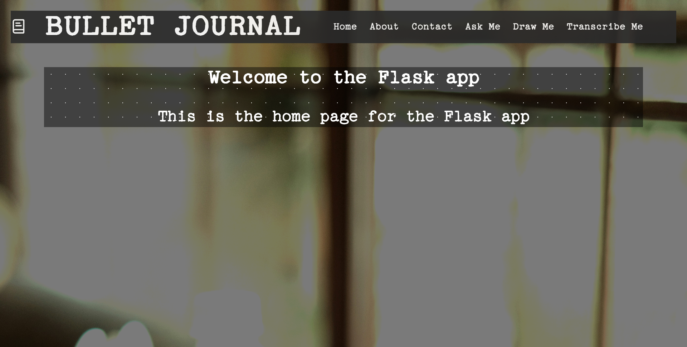

# Content:
## Global Variables!
```css
    :root {
    --text: #edf1fc;
    --text-red: #e14a49;
    --text-green: #15b64f;
    --text-blue: #3f76ed;
    --text-purple: #9b4ff0;
    /* Page Colors */
    --page: #ffffff77;
    --page-manila: #f3deaf;
    --page-card: #f3deaf;
    --grid-size: 32px 32px;
    }

    @media (prefers-color-scheme: dark) {
        :root {
            --page: #00000077;
            --text: #ffffff;
        }
    }
```

### Paper Dots and Grids:
```html
<div class="paper-dots">
  <h2>Welcome to the Flask app<h2>
      <h3>This is the home page for the Flask app<h3>
</div>
```

```html
<div class="paper-grid">
  <h2>Welcome to the Flask app<h2>
      <h3>This is the home page for the Flask app<h3>
</div>
```


- Utilize the paper grid and dots to get a graph paper-like effect on a container.
- Utilize this for text boxes or where the user enters text.
### Background Image:
```html
<style>
  body {
    background-image: url('{{img_url}}');
    background-size: cover;
    height: 100vh;
    background-color: rgba(0, 0, 0, 0.522);
    background-blend-mode: darken;
  }
</style>
```
- If no query is passed in, or left as an empty string, then it will default to time based queries. 
- To utilize the current home page background image into your page, just utilize this in your html file.
- This does require a the render_template to contain the background image for your code to work. Just add it to your return thusly:
    ```py
    return render_template('yourhtmlfile.html', img_url = background_image)
    # OR
    return render_template('yourhtmlfile.html', img_url = back_img("Your desired topic"))
    ```
### Fonts
- Currently, the open source typerwriter-like font TT2020 is being utilized for fonts. It is being used globally.
- 


# APIs used:
- Lucide for symbols: https://lucide.dev/icons/book-text
- Unsplash for background images: https://unsplash.com/
- Future Ones:
- - NASA for Astronomy Image of the Day and photos of Earth: https://api.nasa.gov/ 